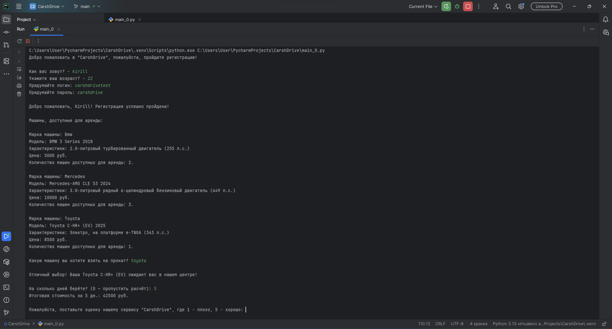

# CarshDrive 🚗

Учебный консольный сервис аренды автомобилей на Python.  
Проект создан для практики работы с **Python**, **Git** и **GitHub**.


---

## ✨ Функционал
- 🔐 Регистрация пользователя (логин + пароль)  
- 👶 Проверка возраста (аренда доступна только с 18 лет)  
- 🚘 Каталог автомобилей с характеристиками, ценой и количеством доступных машин  
- 📅 Выбор машины и расчёт стоимости аренды по дням  
- ⭐ Оценка сервиса после завершения  

---

## 🚀 Запуск
Требуется **Python 3.10+**  

```bash
# Клонировать репозиторий
git clone git@github.com:KEgubov/carshdrive.git

# Перейти в проект
cd carshdrive

# Запустить
python main.py
```
## 📂 Структура проекта

```bash
carshdrive/
│── main.py # -----> основной код программы
│── README.md # -----> описание проекта
│── .gitignore # -----> игнорируемые файлы
│── LICENSE # -----> лицензия
│── docs     ──│    # папка с HTML сайтом и скриншотами
               │── screenshots # -----> скриншоты
               │── index.html # -----> HTML сайт
│── models   ──│ # -----> папка с классами
               │── car.py # -----> класс машин
│── services ──│ # -----> папка с логикой 
               │── registration.py # -----> логика регистрации
               │── rent_cars.py # -----> логика аренды машин
```

## 📸 Пример работы

- Добро пожаловать в "CarshDrive", пожалуйста, пройдите регистрацию!
- Как вас зовут? - Иван
- Укажите ваш возраст? - 20
- Придумайте логин: ivan
- Придумайте пароль: 1234

- Добро пожаловать, Ivan! Регистрация успешно пройдена!

- Машины, доступные для аренды:
- Марка машины: Bmw 
- Модель: BMW 3 Series 2018 
- Характеристики: 2.0-литровый турбированный двигатель (255 л.с.)
- Цена: 50000 руб.
- Количество машин доступных для аренды: 2

## 📸 Демонстрация работы

Ниже пример запуска программы в консоли:




## 🛠 Технологии

- Python (словари, циклы, условия, обработка ошибок, ООП, архитектура)

- Git (инициализация, коммиты, push/pull)

- GitHub (управление проектом, README, .gitignore)

## 📜 Лицензия
Этот проект распространяется под лицензией [MIT](./LICENSE).  
Вы можете использовать и изменять код свободно, при условии сохранения ссылки на автора.

## 👤 Автор

- https://github.com/KEgubov
